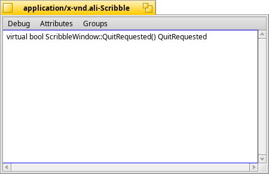

# DebugMonitor
### by Alister



This tiny piece of software improves the reliability and maintainability of your code. Like most of the dials and gauges in a Boeing 747 cockpit are for monitoring performance (rather than actually flying the plane), this library allows to you to have your program monitor itself, and report its state. If you aren't familiar with this idea, read 'Writing Solid Code' (Microsoft Press). You should also be aware of the C standard library function assert (<assert.h>).

There are a couple of other similar debugging assistant libraries out there for the BeOS, I know. This one is simple and very extensible. This one isn't intended to help driver writers, etc., but very much for application writers.


## Functionality

The application to be debugged links with DebugClient.so and uses four macros included from DebugClient.h:

```
trace(msg)
warn(expr,msg) 
tracex(group,level,msg)
warnx(expr,group,level,msg)
```
 
If the preprocessor symbol NDEBUG is defined they do nothing, at no penalty to speed or memory. 

Otherwise, trace and tracex send a BMessage to a monitor application for display. warn and warnx do the same, if expr resolves to true. tracex and warnx also take a string for a group, and a uint for a level which would allow a good monitor app to display the messages intelligently.  


## Client side architecture

A small DebugClient object sets up a BMessenger object pointing to the DebugMonitor application and on trace messages, loads a BMessage with pertinent data and sends it off.

The footprint in the client application is very small, meaning that no interface or windows are delivered by the client side of the library, and moreover, if the client goes down the debug messages are safely away in the Monitor application.

For each trace the monitor receives: 
* the clients app's signature
* thread name and id
* source file, line number
* function name
* the message itself
* time the message was created
* group and level.


## Server side architecture

The Monitor application is free to operate independently of the client, and is therefore eminently suited to incremental improvement, without requiring relinking of client applications. The Monitor application included in this release is relatively straightforward. It displays the messages from each client app in a new window, printing a line with selected attributes (controlled by menu). Each message is filtered through a group and level filter also controlled by menu.


## Future extensions

I think the BMessage approach makes the design eminently extensible. Some ideas I have include:

1. The server side should be improved to display the messages in a ColumnListView, and with visual manipulation of column width and order.

2. It could do something smart with call history or profiling.  


## DebugClient folder

Builds the DebugClient.so library, which is included in apps to be debugged.
Also contains DebugClient.h.


## DebugMonitor folder

The current incarnation of the DebugMonitor app. Build and run, does nothing until the first message received.


## Scribble sample app folder

The Scribble app included is a very small app with a couple of trace statements to demonstrate the functionality. 


## About me:
My email is alister@pobox.com and this stuff may be on a web page at www.pobox.com/~alister

Please let me know if this is any use to you, or if you take it anywhere better.

Regards,
Alister Lee.
